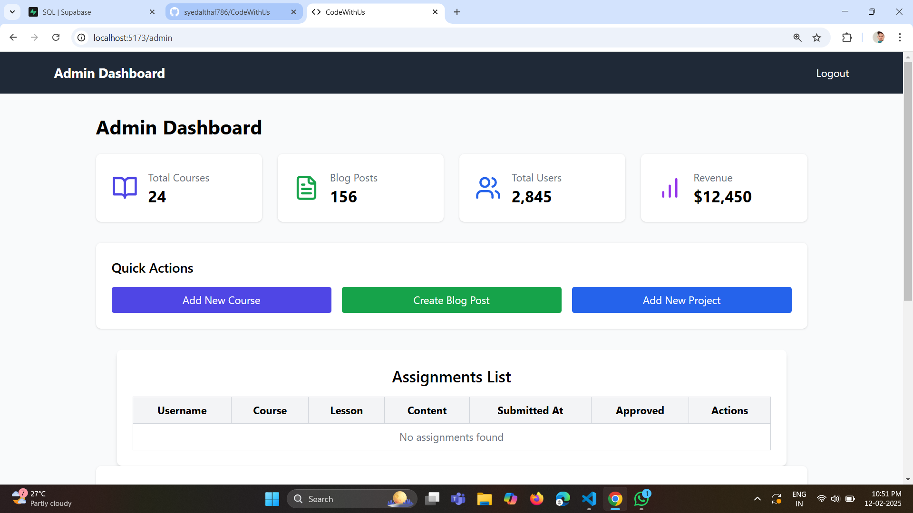
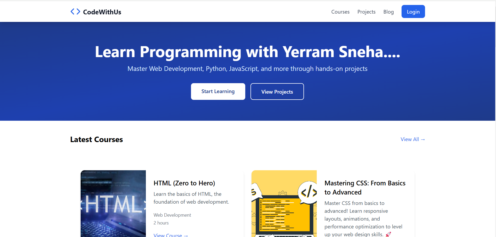

# CodeWithUs

Welcome to CodeWithUs, a comprehensive platform for managing courses, projects, and blog posts. This project is built using React, Tailwind CSS, and Supabase, and is optimized for mobile devices.

## Table of Contents

- [Features](#features)
- [Installation](#installation)
- [Usage](#usage)
- [Project Structure](#project-structure)
- [Screenshots](#screenshots)
- [Contributing](#contributing)
- [License](#license)

## Features

- **Admin Dashboard**: Manage courses, projects, and blog posts.
- **Responsive Design**: Optimized for mobile, tablet, and desktop devices.
- **Authentication**: Admin login and logout functionality.
- **CRUD Operations**: Create, read, update, and delete courses, projects, and blog posts.
- **Supabase Integration**: Backend as a service for database management.

## Installation

To get started with CodeWithUs, follow these steps:

1. **Clone the repository**:
    ```bash
    git clone https://github.com/your-username/codewithus.git
    cd codewithus
    ```

2. **Install dependencies**:
    ```bash
    npm install
    ```

3. **Set up Supabase**:
    - Create a Supabase project at [supabase.io](https://supabase.io).
    - Create the necessary tables (`courses`, `lessons`, `blog_posts`, etc.).
    - Obtain your Supabase URL and API key.

4. **Configure environment variables**:
    - Create a `.env` file in the root directory.
    - Add your Supabase URL and API key:
      ```env
      REACT_APP_SUPABASE_URL=your-supabase-url
      REACT_APP_SUPABASE_ANON_KEY=your-supabase-anon-key
      ```

5. **Start the development server**:
    ```bash
    npm start
    ```

## Usage

### Admin Login

1. Navigate to the login page.
2. Enter the admin credentials (default: `admin@example.com` / `admin123`).
3. Access the admin dashboard to manage courses, projects, and blog posts.

### Managing Courses

- **Add Course**: Navigate to the "Add New Course" page and fill in the course details.
- **Edit Course**: Click the "Edit" button next to a course to update its details.
- **Delete Course**: Click the "Delete" button next to a course to remove it.

### Managing Projects

- **Add Project**: Navigate to the "Add New Project" page and fill in the project details.
- **Edit Project**: Click the "Edit" button next to a project to update its details.
- **Delete Project**: Click the "Delete" button next to a project to remove it.

### Managing Blog Posts

- **Add Blog Post**: Navigate to the "Create Blog Post" page and fill in the blog post details.
- **Edit Blog Post**: Click the "Edit" button next to a blog post to update its details.
- **Delete Blog Post**: Click the "Delete" button next to a blog post to remove it.

## Project Structure

## Screenshots

Here are some screenshots of the CodeWithUs platform:

### Admin Dashboard



### Home page




## Contributing

We welcome contributions to CodeWithUs! To contribute, follow these steps:

1. **Fork the repository**.
2. **Create a new branch**:
    ```bash
    git checkout -b feature/your-feature-name
    ```
3. **Make your changes**.
4. **Commit your changes**:
    ```bash
    git commit -m 'Add some feature'
    ```
5. **Push to the branch**:
    ```bash
    git push origin feature/your-feature-name
    ```
6. **Create a pull request**.

## License

This project is licensed under the MIT License. See the LICENSE file for details.
